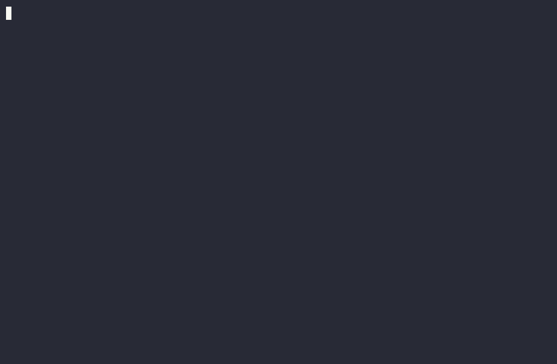

# Qwen3.8-27B on one RTX 4090



Serve Qwen3.8-27B on a single 24 GB RTX 4090 through an OpenAI-compatible vLLM
API. The repository contains the pinned container, model preparation, runtime
patches, two production modes, and the validation/benchmark tools used for the
published results.

This is an independent RTX 4090 port and extension of
[`syv-ai/qwen38-27b-rtx3090`](https://github.com/syv-ai/qwen38-27b-rtx3090),
not an official continuation.

## Modes

| Profile | Purpose | Validated result |
|---|---|---:|
| `single-user` | recommended low-latency coding assistant, 450 W | 237.9 tok/s sustained decode |
| `single-user-efficient` | same inference settings, 250 W | 160.5 tok/s reference-protocol median |
| `batch` | recommended quality-first C32 service, 350 W | 1,318.4 aggregate decode / 1,141.4 E2E tok/s |
| `batch-max` | experimental C64 throughput, 450 W | 2,029.8 aggregate decode / 1,803.3 E2E tok/s |

`batch-max` measured a 3.566% perplexity regression and is not the default.
Aggregate batch throughput is not single-request speed. Full methodology and
quality results are in [RELEASE.md](RELEASE.md).

## Requirements

- Native Linux and one NVIDIA RTX 4090 / SM89.
- NVIDIA driver compatible with CUDA 13 containers.
- Docker Engine, Docker Compose v2, and NVIDIA Container Toolkit.
- At least 25 GB for prepared models, about 10 GB for the image, and additional
  SSD space for caches and benchmark results.

## Storage

Tracked profiles use ignored `.artifacts/` directories. To reuse an existing
model directory or another SSD, copy a profile to an ignored local file:

```bash
cp profiles/single-user.env profiles/single-user.local.env
```

Edit the copy:

```dotenv
MODELS_DIR=/path/to/models
CACHE_DIR=/path/to/cache
QUALITY_DATA_DIR=/path/to/quality-data
BENCH_RESULTS_DIR=/path/to/bench-results
```

Use it consistently:

```bash
export PROFILE_FILE=profiles/single-user.local.env
```

If the model downloads again, the active `MODELS_DIR` does not point to the
directory containing `Qwen3.8-27B-W4A16-AutoRound`. Downloads are resumable and
preparation does not intentionally delete checkpoints.

Keep `HF_TOKEN` and `VLLM_API_KEY` in the invoking shell, never in a tracked
file.

## Prepare once

```bash
scripts/prepare.sh
```

This builds `qwen38-27b-rtx4090:latest`, downloads pinned model artifacts, and
runs idempotent quantization/preparation. The same prepared model is used by
both modes.

## Single-user

```bash
scripts/run-single-user.sh --set-power-limit
scripts/validate-single-user.sh
scripts/benchmark-single-user.sh single-user my-run
```

The first launch can spend several minutes compiling kernels and capturing CUDA
graphs. The API binds only `127.0.0.1:18020` on the host.

```bash
curl -fsS http://127.0.0.1:18020/v1/chat/completions \
  -H 'Content-Type: application/json' \
  -d '{"model":"qwen3.8-27b","messages":[{"role":"user","content":"Write a Python hello-world."}],"max_tokens":64,"temperature":0,"chat_template_kwargs":{"enable_thinking":false}}'
```

Stop without deleting artifacts:

```bash
scripts/stop-single-user.sh
```

## Batch

```bash
scripts/run-batch.sh batch --set-power-limit
scripts/validate-batch.sh batch
scripts/benchmark-batch.sh batch --help
```

Use `scripts/run-batch.sh batch-max --set-power-limit` only when the documented
quality trade is acceptable. C64 is validated for 512-token outputs; use C48 or
less for 1,024-token outputs.

Stop with `scripts/stop-batch.sh batch`.

## Quality checks

```bash
scripts/prepare-quality-data.sh
scripts/quality-single-user.sh single-user my-quality-run
```

## Repository contents

| Path | Why it belongs |
|---|---|
| `compose.yml`, `Dockerfile`, `docker/` | one production container definition and its entrypoint/dependencies |
| `profiles/` | the four documented operating envelopes; local overrides are ignored |
| `runtime/` | the two exact vLLM launch commands |
| `scripts/` | preparation, launch, stop, validation, and benchmark interfaces |
| `prepare/` | only the main checkpoint and DFlash2 preparation pipeline |
| `patches/` | the runtime patch stack used by the validated image |
| `integrations/codex/` | Responses/tool-call compatibility required by coding clients |
| `bench/`, `benchmarks/` | API, quality, batch, and checksum-fixed C1 benchmark inputs |
| `release-manifest.json`, `RELEASE.md` | pinned provenance and measured evidence |
| `docs/` | reproduction instructions and condensed technical history |

Models, caches, quality datasets, benchmark output, logs, local profiles, Python
caches, and native build products are ignored by Git and excluded from Docker
build context.

## Limits

- The release claim is native Linux on one RTX 4090; WSL2 and multi-GPU are not
  validated production configurations.
- VRAM headroom is narrow. Stop other GPU workloads if startup OOMs.
- `single-user` is validated to a configured 65,536-token context.
- `batch` retrieved correctly at a 99,982-token prompt; its configured 150,000
  limit is not a claim of full validation at that length.
- Add authentication and a network boundary before exposing the API beyond
  loopback.

See [docs/REPRODUCTION.md](docs/REPRODUCTION.md) for the complete workflow and
[docs/TECHNICAL-HISTORY.md](docs/TECHNICAL-HISTORY.md) for why these profiles
were selected.

## License

Repository code is under [Apache License 2.0](LICENSE), preserved from the
reference project. Model checkpoints and dependencies retain their own licenses.
